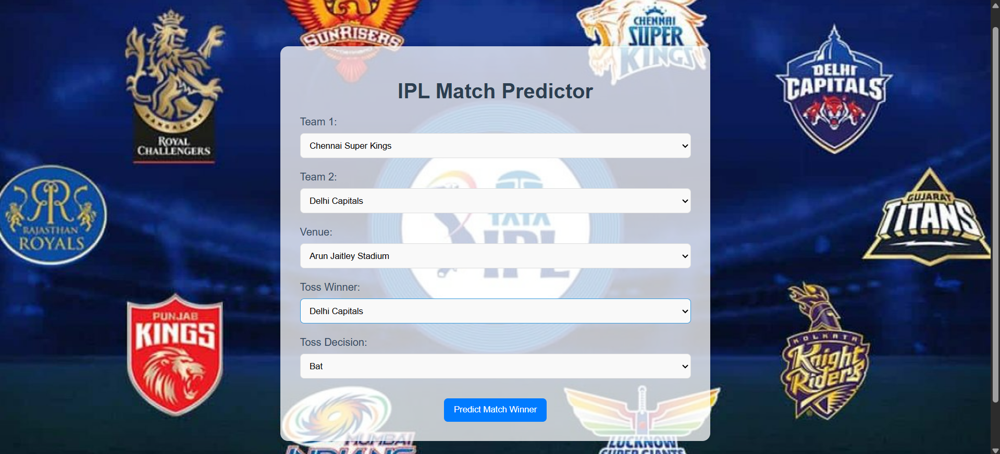
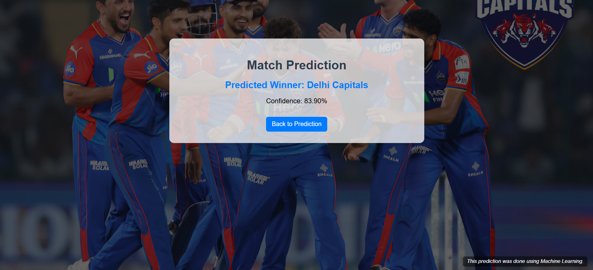

# IPL Match Prediction Project

This project predicts the winner of an Indian Premier League (IPL) match using machine learning models trained on historical data from 2008 to 2024. It includes a Jupyter notebook for model development and a Flask-based web application for real-time predictions.

🖥️ **Live Demo:** [https://ipl-win-predictor-6h4c.onrender.com](https://ipl-win-predictor-6h4c.onrender.com)

---

## Table of Contents
1. [Project Overview](#project-overview)  
2. [Features](#features)  
3. [Technologies Used](#technologies-used)  
4. [Setup Instructions](#setup-instructions)  
5. [How to Use](#how-to-use)  
6. [API Endpoints](#api-endpoints)  
7. [Future Improvements](#future-improvements)  
8. [License](#license)  
9. [Acknowledgments](#acknowledgments)  

---

## Project Overview

The IPL Match Predictor is a machine learning project that analyzes match conditions and predicts the winner of an IPL match. It uses:
- Teams (`team1`, `team2`)
- Venue of the match
- Toss winner and toss decision
- Average runs scored by each team in their last 5 matches

The Flask app provides an interactive interface where users can input match details and receive predictions instantly.

---

## Features

- **Interactive Web Interface:** User-friendly form to input match data
- **Real-Time Predictions:** Results are calculated instantly based on input
- **Pre-Trained Models:** Models trained on IPL data from 2008–2024
- **Multiple Models Supported:** Gradient Boosting and Random Forest
- **Jupyter Notebook:** For model building and evaluation

---

## Technologies Used

- **Python 3.9+**
- **Flask** – for web framework  
- **Scikit-learn** – machine learning  
- **Pandas, NumPy** – data processing  
- **HTML/CSS** – front-end UI  
- **Joblib / Pickle** – model serialization

---

## Setup Instructions

### Prerequisites

- Python 3.9 or higher  
- pip (Python package installer)

### Steps

1. **Clone the Repository**
```bash
git clone https://github.com/pkala7968/ipl-win-predictor.git
cd ipl-win-predictor
```

2. **Create a Virtual Environment:**
```bash
python -m venv venv
# On Linux/Mac
source venv/bin/activate  
# On Windows
venv\Scripts\activate
```

3. **Install Dependencies:**
```bash
pip install -r requirements.txt
```

4. **Run the Flask App:**
```bash
python app.py
```

5. **Access the Application:**
Open your browser and go to [http://127.0.0.1:5000/](http://127.0.0.1:5000/).

6. Or Use the Deployed Version:
https://ipl-win-predictor-6h4c.onrender.com


---

## How to Use
### 1. Home Page
- Open the application in your browser.  
- You will see a form with dropdowns for teams, venues, and toss decisions.  

### 2. Input Match Details
- Select `team1`, `team2`, `venue`, `toss_winner`, and `toss_decision` from the dropdowns.  
- Enter the average runs scored by `team1` and `team2` in their last 5 matches.  

### 3. Get Prediction
- Click the **"Predict"** button.  
- The predicted winner will be displayed on the screen.  

---

## API Endpoints
### 1. Home Page
- **URL:** `/`  
- **Method:** `GET`  
- **Description:** Renders the home page with the input form.  

### 2. Prediction Endpoint
- **URL:** `/predict`  
- **Method:** `POST`  
- **Description:** Accepts form data and returns the predicted winner in JSON format.  

#### Request Body:
```json
{
  "team1": "Chennai Super Kings",
  "team2": "Mumbai Indians",
  "venue": "Wankhede Stadium",
  "toss_winner": "Chennai Super Kings",
  "toss_decision": "bat",
}
```


#### Response:
```json
{
  "predicted_winner": "Chennai Super Kings"
}
```


---

## Future Improvements
- **Add More Features:** Include additional features like player statistics, weather conditions, and head-to-head records.  
- **Improve Model Accuracy:** Train the model on a larger and more recent dataset.  
- **Deploy to Cloud:** Done ✅ [Render App](https://ipl-win-predictor-6h4c.onrender.com)
- **User Authentication:** Add user authentication to save prediction history.  

---

## License
This project is licensed under the **MIT License**. See the [LICENSE](LICENSE) file for details.

---

## Acknowledgments
- **Dataset:** [Kaggle IPL Dataset](https://www.kaggle.com/datasets/patrickb1912/ipl-complete-dataset-20082020) 
- **Flask Documentation:** [Flask Official Docs](https://flask.palletsprojects.com/)  
- **Scikit-learn Documentation:** [Scikit-learn Official Docs](https://scikit-learn.org/)  